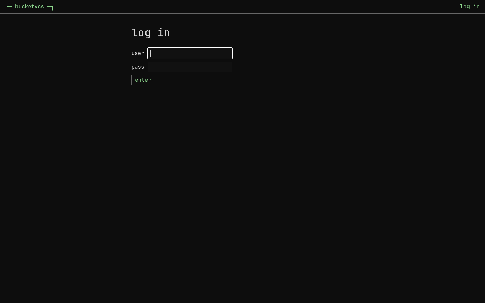
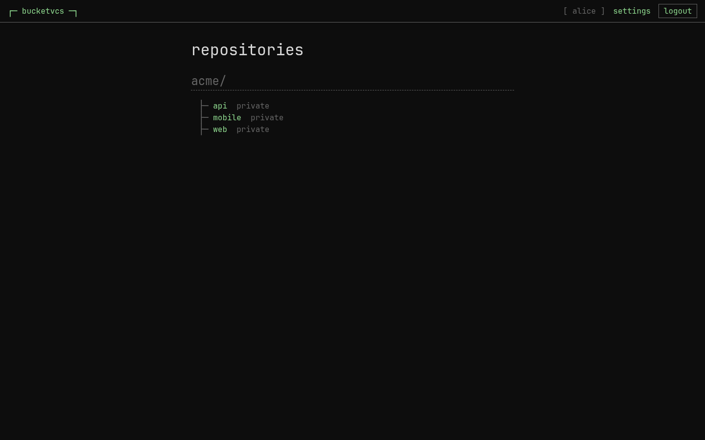
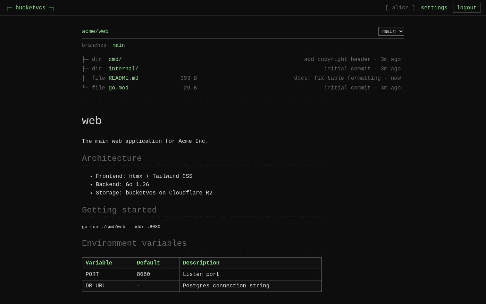
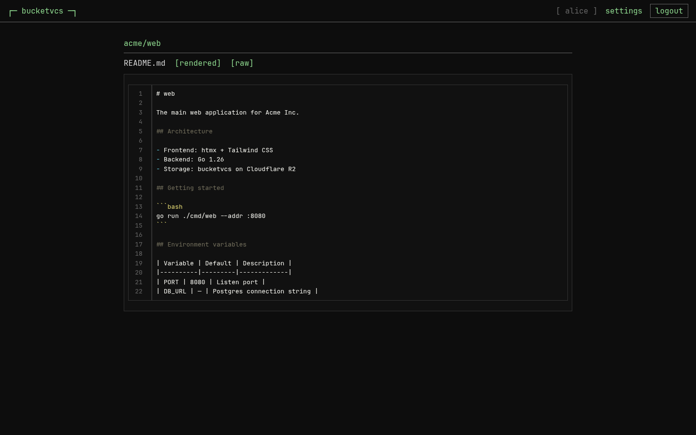
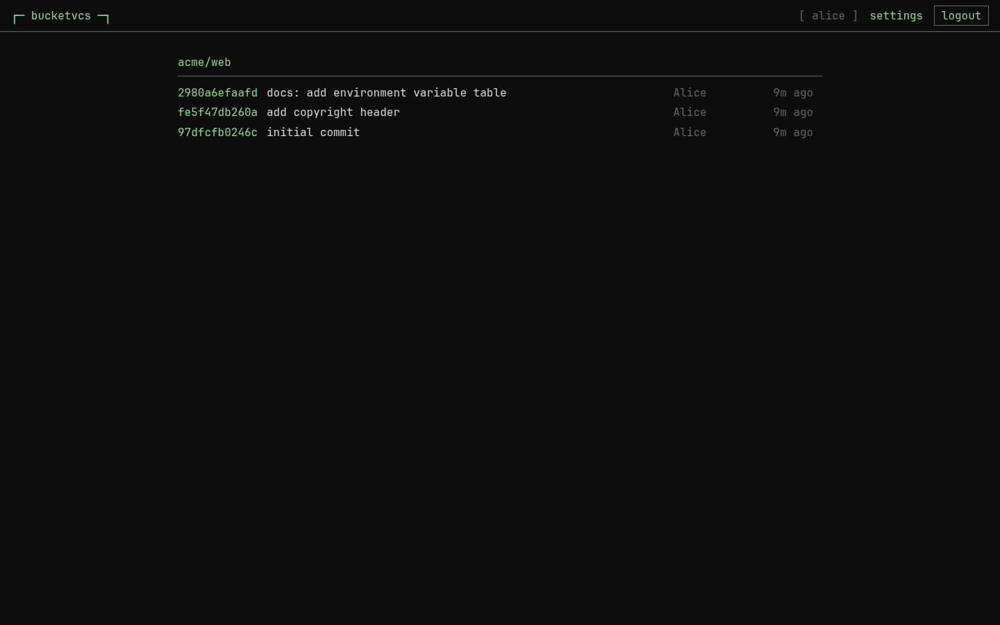

# bucketvcs

### Your repositories live in your bucket.

**bucketvcs is a Git server backed directly by cloud object storage** — Amazon S3, Cloudflare R2, Google Cloud Storage, or Azure Blob. No database cluster holding your Git objects. No ever-growing block-storage volume to snapshot and babysit. The bucket *is* the repository.

Point stock `git` at it over HTTPS or SSH, push, and your history lands in object storage that's effectively infinite, eleven-nines durable, and priced by the gigabyte. Then open the built-in **web UI** to browse it.

---

## Why bucketvcs

### 💸 Object-storage economics
Version control at the price of a bucket. Pay per-GB at S3/R2/GCS/Azure rates instead of provisioning, growing, and backing up block volumes. On Cloudflare R2 there are **no egress fees** — clone and fetch all day. Durability and scale are your provider's problem, not yours.

### 🔐 Your data, your account
Bring your own bucket. Your code sits in **your** cloud account, under **your** encryption keys and **your** access policies — not on a vendor's servers. Delete the deployment tomorrow and your repositories are still right where you left them.

### 🧩 Real Git, no special client
Native **HTTPS and SSH**, Git **protocol v2**, and full compatibility with stock `git` and standard credential helpers. Nothing to install on developer machines. It behaves like the Git remote your team already knows.

### ⚡ Fast clones at scale
Protocol-v2 **bundle-URI** and **packfile-URI** acceleration offload heavy initial clones to signed object-storage URLs (CDN-frontable on cloud backends), so the gateway isn't streaming gigabytes on every onboarding.

### 🖥️ A web UI in the same binary
Log in with a password or **OIDC single sign-on** and browse your code — syntax-highlighted file views with line-anchor links, commit logs, diffs, rendered READMEs. Self-service token and SSH-key management for every user; repo settings (grants, deploy keys, webhooks, protected refs/paths) delegated to repo admins; user/repo/quota administration for operators. No JavaScript build, no separate service — templates and assets are compiled into the binary, and every page works without JS.

### 🔋 Batteries included
Not a toy. bucketvcs ships the things a real Git host needs:

- **Git LFS** — batch transfer, file locks, per-tenant quotas, and LFS garbage collection
- **Keyless CI** — OIDC token exchange (RFC 8693): your pipeline trades its IdP identity for a short-lived, repo-scoped token, so there are no long-lived secrets to leak
- **Build triggers** — fire Google Cloud Build, AWS CodeBuild, or any HTTP endpoint on push, with ref filters and a short-lived clone token → [guide & quickstarts](docs/build-triggers.md)
- **Fine-grained auth** — scoped access tokens with rotation, SSH user & deploy keys, and per-IP rate-limiting on credential failures
- **Policy & governance** — protected refs, protected paths, custom pre/post-receive hooks, and signed, retryable **webhooks**
- **Audit & observability** — structured audit events and metrics for every push, policy decision, and admin action, with durable **log shipping** of the activity and usage (metering) streams into your bucket → [observability overview](docs/operator-guides/observability.md) · [log shipping](docs/operator-guides/log-shipping.md)
- **Self-maintaining** — background repack, commit-graph/reachability maintenance, and operator-driven garbage collection keep storage tight
- **Regional read replicas** — serve clone and fetch traffic close to developers via `--replica-of` over provider-replicated buckets (S3 CRR, GCS dual-region, Azure RA-GRS); all pushes stay in the write region → [operator guide](docs/operator-guides/multi-region.md)
- **Bring-your-own-bucket** — tenants can supply their own S3/GCS/Azure storage; bucketvcs routes their git traffic to their bucket. See [the operator guide](docs/operator-guides/byob.md)
- **Durable auth database** — the embedded SQLite authdb (users, tokens, policy, quotas) replicates continuously into object storage via embedded Litestream (~1s RPO) and restores on boot, so a lost disk doesn't lose your credentials → [replication](docs/operator-guides/authdb-replication.md) · [choosing a backend](docs/operator-guides/authdb-hosting.md)

### 🛠️ Operationally boring (the good kind)
A single pure-Go binary. The only local state is a small SQLite file for auth and metadata — your **Git data never touches a database**. The gateway is easy to run, easy to scale out, and has nothing stateful to lose.

---

## How it compares

Traditional self-hosted Git (GitHub Enterprise, GitLab, Gitea) keeps your repositories on a database and a block-storage filesystem you have to size, monitor, snapshot, and migrate. bucketvcs makes the object store the source of truth instead:

|                        | Traditional Git host        | bucketvcs                          |
|------------------------|-----------------------------|------------------------------------|
| Repo storage           | Block volume + database     | Object storage (the bucket *is* it) |
| Scaling storage        | Resize/migrate volumes      | Unbounded, automatic                |
| Durability & backup    | Your snapshots & ops        | Provider's (eleven 9s)              |
| Data ownership         | Vendor-managed              | Your cloud account, your keys       |
| Footprint              | Services + DB + storage     | One Go binary + a bucket            |

Runs on **S3, R2, GCS, and Azure Blob** (all first-class), plus a local-filesystem backend for development that needs no credentials.

---

> Upgrading from an earlier release? See the **[upgrade notes](docs/upgrade-notes.md)**.

---

## Get started

### Install

Prebuilt binaries for **Linux, macOS, and Windows** (amd64 + arm64) are attached
to every [GitHub Release](https://github.com/erans/bucketvcs/releases), alongside
a `checksums.txt`. Pick the version you want, then grab the matching artifact:

```bash
VER=0.5.1   # latest: https://github.com/erans/bucketvcs/releases/latest
```

**Linux** — `.deb`, `.rpm`, or a portable tarball (swap `amd64` → `arm64` on ARM):

```bash
# Debian / Ubuntu
curl -fsSLO https://github.com/erans/bucketvcs/releases/download/v$VER/bucketvcs_${VER}_linux_amd64.deb
sudo dpkg -i bucketvcs_${VER}_linux_amd64.deb

# Fedora / RHEL / openSUSE
curl -fsSLO https://github.com/erans/bucketvcs/releases/download/v$VER/bucketvcs_${VER}_linux_amd64.rpm
sudo rpm -i bucketvcs_${VER}_linux_amd64.rpm

# Any distro (tarball)
curl -fsSL https://github.com/erans/bucketvcs/releases/download/v$VER/bucketvcs_${VER}_linux_amd64.tar.gz | tar xz
sudo install bucketvcs /usr/local/bin/
```

**macOS** — tarball (`arm64` = Apple Silicon, `amd64` = Intel):

```bash
curl -fsSL https://github.com/erans/bucketvcs/releases/download/v$VER/bucketvcs_${VER}_darwin_arm64.tar.gz | tar xz
sudo install bucketvcs /usr/local/bin/
# binaries aren't notarized yet; if Gatekeeper blocks the first run, clear the quarantine flag:
xattr -d com.apple.quarantine /usr/local/bin/bucketvcs 2>/dev/null || true
```

**Windows** (PowerShell) — zip:

```powershell
$ver = "0.5.1"
Invoke-WebRequest "https://github.com/erans/bucketvcs/releases/download/v$ver/bucketvcs_${ver}_windows_amd64.zip" -OutFile bucketvcs.zip
Expand-Archive bucketvcs.zip -DestinationPath $Env:LOCALAPPDATA\bucketvcs
# then add %LOCALAPPDATA%\bucketvcs to your PATH
```

**From source** (Go 1.26+):

```bash
git clone https://github.com/erans/bucketvcs
cd bucketvcs && go build -o bucketvcs ./cmd/bucketvcs
```

Put the resulting `bucketvcs` binary on your `PATH`.

### First push

A complete end-to-end walkthrough — a repository, access control, the gateway,
and your first push (on local disk or any cloud backend) — lives in the
**[Quickstart](docs/quickstart.md)**.

The short version:

```bash
bucketvcs init   --store s3://my-bucket my-org my-repo
bucketvcs serve  --store s3://my-bucket --addr :8080
git push https://my-host/my-org/my-repo main
```

Then open `http://my-host:8080/` in a browser — the web UI serves on the same
listener (log in with a user created via `bucketvcs user add` + `user set-password`,
or wire up OIDC; see the [web UI guide](docs/operator-guides/web-ui.md)).

The web UI is **optional** — omit `--ui` or pass `--ui=false` if you only need the Git protocol gateway and CLI.

`bucketvcs doctor` — read-only health checks for storage, auth-db, and config. Accepts the same flags as `serve`; swap `serve` for `doctor` to validate a deployment without binding any ports.

**Next:** want pushes to kick off CI? Wire up [build triggers](docs/build-triggers.md) to start a Google Cloud Build, AWS CodeBuild, or any HTTP endpoint on push.

---

## Web UI

The web UI is built in to the same binary — no separate service, no JavaScript build step, no external dependencies. Templates and static assets are compiled into the binary at build time; every page works without JS.

| Login | Repositories |
|-------|--------------|
|  |  |

| File tree with rendered README | Syntax-highlighted file view |
|-------------------------------|------------------------------|
|  |  |

| Commit history |
|----------------|
|  |

The UI is **optional**. Run without it by omitting `--ui` or passing `--ui=false` — the Git gateway and all CLI commands work the same either way.

---

## Status

bucketvcs is open-source and built for production use. A single binary serves the **Git protocol** (HTTPS/SSH) and an embedded **web UI** — browse code in the browser, log in with a password or OIDC SSO, and manage users, repos, tokens, webhooks, and policies from the settings pages. Everything is equally administrable through the `bucketvcs` CLI.

Run `bucketvcs <command> --help` for the full command surface, and browse **[`docs/`](docs/)** for design specs, operator guides, and quickstarts.

---

## License

Licensed under the [Apache License, Version 2.0](LICENSE). Copyright 2026 Eran Sandler.

Distributed binaries statically link third-party Go modules; see [NOTICE](NOTICE) for required attributions and [THIRD_PARTY_LICENSES](THIRD_PARTY_LICENSES) for their full license texts.
